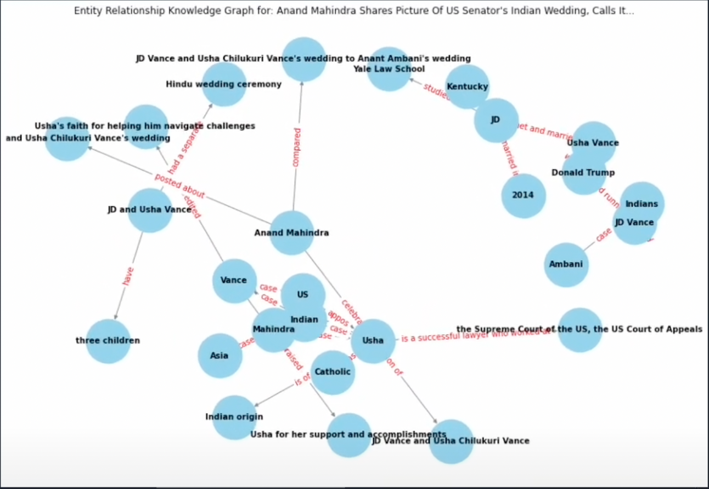

# News Entity Graph Builder

<p align="center">
  
  
</p>

This project scrapes real-time news articles from NDTV, uses NLP (spaCy) to extract named entities, and optionally enriches relationships between those entities using GPT-4. The results are stored in a PostgreSQL database and visualized as knowledge graphs using NetworkX and Matplotlib.

---

## Features

- Scrape articles from [ndtv.com](https://ndtv.com)
- Named Entity Recognition using spaCy
- GPT-4 powered entity relationship enrichment
- SQL storage for articles, entities, and relationships
- Interactive knowledge graph visualizations with NetworkX

---

## 🛠️ Setup Instructions

### 1. Clone the Repository

```bash
git clone https://github.com/varunpalanisamy/News-Entity-Graph-Builder.git
cd News-Entity-Graph-Builder
```

### 2. Create & Activate Virtual Environment

```bash
python -m venv venv
source venv/bin/activate
```

### 3. Install Requirements

```bash
pip install -r requirements.txt
python -m spacy download en_core_web_sm
```

### 4. Set Up Your `.env` File

Create a `.env` file in the root:

```
OPENAI_API_KEY=your-openai-key
DB_NAME=mydatabase
DB_USER=your-username
DB_PASSWORD=your-password
DB_HOST=localhost
DB_PORT=5432
```

### 5. Create the PostgreSQL Tables

Connect to your database and run:

```sql
CREATE TABLE articles (
    id SERIAL PRIMARY KEY,
    title TEXT,
    date DATE,
    content TEXT,
    url TEXT
);

CREATE TABLE entities (
    id SERIAL PRIMARY KEY,
    article_id INTEGER REFERENCES articles(id),
    entity TEXT,
    label TEXT
);

CREATE TABLE relationships (
    id SERIAL PRIMARY KEY,
    article_id INTEGER REFERENCES articles(id),
    entity_1 TEXT,
    relationship TEXT,
    entity_2 TEXT
);
```

### 6. Run the App

```bash
python src/main.py
```
